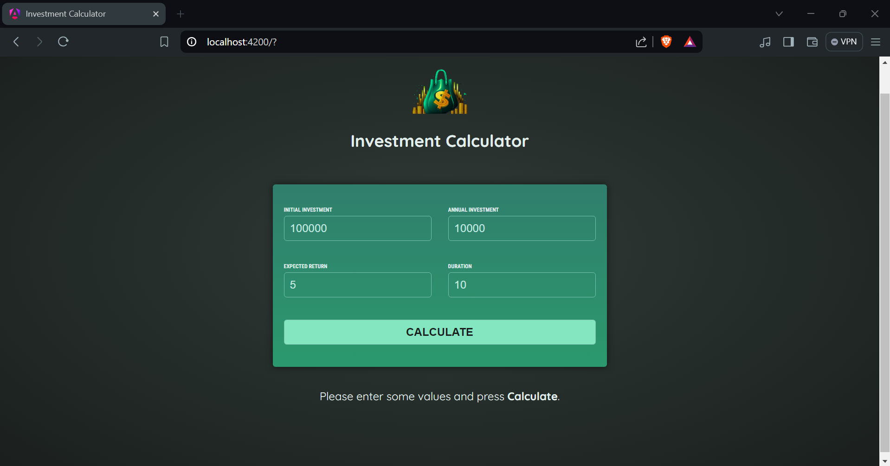
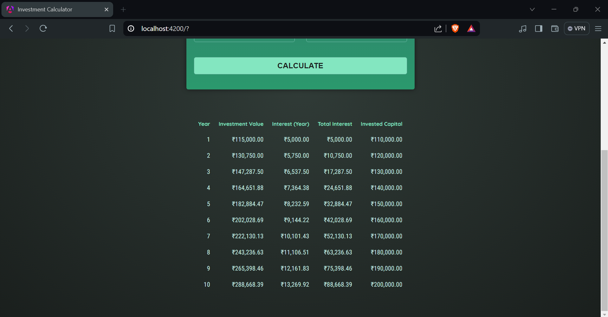

# Investment Calculator

The Investment Calculator is an Angular application that helps users estimate the growth of their investments over time based on initial investment, annual contributions, expected returns, and investment duration.

## Table of Contents
- [Overview](#overview)
- [Features](#features)
- [Technologies Used](#technologies-used)
- [Setup Instructions](#setup-instructions)
- [Usage](#usage)
- [Screenshots](#screenshots)

## Overview
The Investment Calculator project consists of several components that work together to provide a user-friendly interface for calculating investment growth:
- **Header Component**: Displays the title and image of the application.
- **User Input Component**: Collects user inputs such as initial investment, annual investment, expected return, and investment duration.
- **Investment Results Component**: Calculates and displays investment growth results in a tabular format.

## Features
- **Dynamic Calculation**: Calculates investment growth dynamically based on user inputs.
- **Responsive Design**: Ensures the application is accessible and functional across different devices.
- **Clear Presentation**: Presents investment results in a clear and organized table format.

## Technologies Used
- Angular
- HTML
- CSS
- TypeScript

## Setup Instructions
To run the Investment Calculator locally, follow these steps:

1. **Clone the Repository**:
   ```bash
   git clone https://github.com/sakethyalamanchili/Investment-Calculator.git
   cd investment-calculator
   ```

2. **Install Dependencies**:
   ```bash
   npm install
   ```

3. **Run the Application**:
   ```bash
   ng serve
   ```
   Navigate to `http://localhost:4200/` in your browser.

## Usage
1. Fill out the investment details in the provided form.
2. Click the "Calculate" button to see the projected investment growth over time.

## Screenshots


